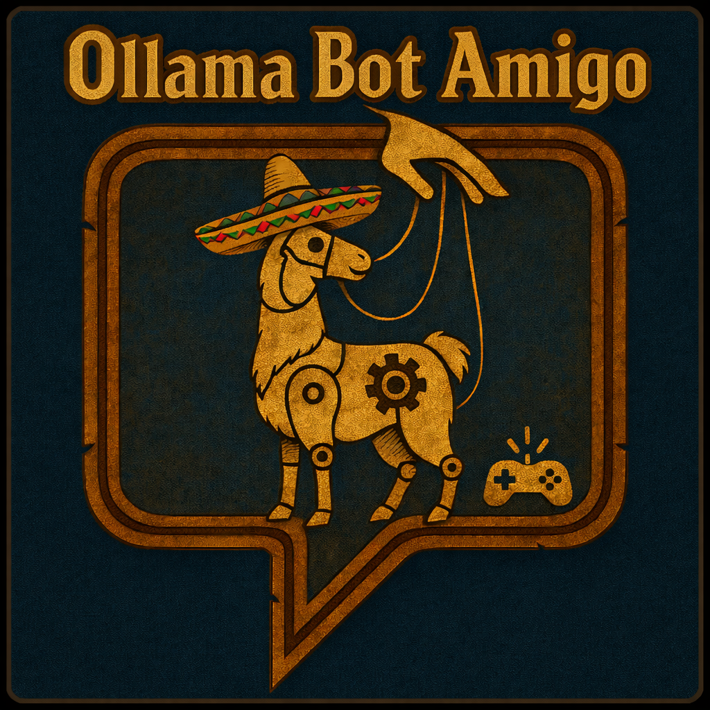

  

# AzerothCore + Playerbots Module: mod-ollama-bot-amigo

> [!CAUTION]
> NOT FOR GENERAL USE YET -
> This module is very experimental at the moment and will not work, may break your server and will cause significant CPU load on your server due to LLM-driven bot automation. Use with caution.

## Overview

***mod-ollama-bot-amigo*** is an experimental AzerothCore module (forked from Ollama Buddy bot) that connects Playerbots to an Ollama LLM for planning and a bounded set of control actions. The LLM picks a single tool call per tick; the module validates it and maps it to Playerbot commands. Combat tactics remain in PlayerbotAI, and the current focus is controlled movement, grind toggles, quest-giver interaction, and fishing.

## Features

- **Planner + control loop:** Optional long-term + short-term planner roles feed a control role that must emit exactly one tool call.
- **Strict tool-call enforcement:** Control responses must be exactly one `<tool_call>` block with validated arguments.
- **PlayerbotAI command bridge:** Tool calls map to Playerbot commands (move/grind/talk/turn); combat tactics remain inside PlayerbotAI.
- **Navigation + travel semantics:** The module builds nav candidates, validates reachability, and tracks move hop completion.
- **Quest and world snapshots:** Exposes active quests, quest givers in range, nearby entities, and local/world labels.
- **Profession execution (fishing only):** `request_fish` and `request_profession` support fishing; other professions are rejected for now.
- **Persistent memory tables:** Optional planner/stuck/vendor tables in CharacterDatabase; currently used for cooldown/backoff and diagnostics (not injected into prompts yet).
- **Configurable models and logging:** Per-role models/prompts, tick timing, and debug logging toggles.

---

## Installation

> [!IMPORTANT]
> Dependencies are verified on macOS Monterey 12.7.6 and Ubuntu 22.04 LTS. Please open an issue with your OS and steps if you hit any compatibility issues.

1. **Prerequisites:**
   - A working AzerothCore (https://github.com/mod-playerbots/azerothcore-wotlk/tree/Playerbot) with the Player Bots module (https://github.com/mod-playerbots/mod-playerbots).
   - Requires:
     - cURL (https://curl.se/libcurl/)
     - fmtlib (https://github.com/fmtlib/fmt)
     - nlohmann/json (https://github.com/nlohmann/json)
     - Ollama LLM API server (https://ollama.com), running locally or accessible over your network.

2. **Clone the Module:**
   cd /path/to/azerothcore/modules
   git clone (https://github.com/notOrrytrout/mod-ollama-bot-amigo.git)

3. **Recompile AzerothCore:**
   cd /path/to/azerothcore
   mkdir build && cd build
   cmake ..
   make -j$(nproc)

4. **Configuration:**
   Copy the sample config and adjust as needed:
   cp /path/to/azerothcore/modules/mod-ollama-bot-amigo/mod_ollama_bot_amigo.conf.dist /path/to/azerothcore/etc/config/mod_ollama_bot_amigo.conf

5. **Restart the Server:**
   ./worldserver

## Configuration Options

All configuration is in `mod_ollama_bot_amigo.conf`. Key settings:

- **Configuration precedence:**
  Environment variables (`AC_...`) override values in `mod_ollama_bot_amigo.conf`, which override built-in defaults.

- **OllamaBotControl.Enable:**
  Preferred toggle for the control loop (default: `1`).

- **OllamaBotControl.BotName:**
  Optional bot name filter (comma-separated list). Leave empty for all bots.

- **OllamaBotControl.Url:**
  Endpoint for Ollama API (`http://localhost:11434/api/generate` by default)

- **OllamaBotControl.Model.Planner / .PlannerLongTerm / .PlannerShortTerm / .Control:**
  Per-role LLM model identifiers (long/short fall back to Planner if unset).

- **OllamaBotControl.DelayMs.Control / .STG / .LTG / .Startup:**
  Control request cadence, short-term planner delay, long-term planner delay, and per-bot startup delay (all in ms).

- **OllamaBotControl.Planner.Enable / .Control.Enable:**
  Per-role enable flags for LLM requests.

- **OllamaBotControl.SystemPrompt.Planner / .ShortTerm / .Control:**
  Role-specific system prompts. Use `\n` to embed multi-line prompts inside the single-line config value.

- **OllamaBotControl.PromptFormat:**
  Control prompt formatting mode. `debug` uses verbose labels and pretty JSON. `compact` uses short labels and minified JSON.

- **OllamaBotControl.Nav.BaseDistance / .DistanceMultiplier / .MaxDistance / .DistanceBands:**
  Control navigation candidate distances. Base sets the initial hop size, multiplier scales each band, max caps distance, bands controls how many hop distances are offered.

- **OllamaBotControl.ClearGoalsOnConfigLoad:**
  When enabled, clears planner/control goals once after each config load.

- **OllamaBotControl.Planner.StateSummaryLog.Enable / .Path:**
  When enabled, appends planner `STATE_SUMMARY` blocks to the configured log file.

- **OllamaBotControl.EnablePlannerMemory / .EnableStuckMemory / .EnableVendorMemory:**
  Toggles for enabling planner/stuck/vendor memory storage tables.

- **OllamaBotControl.QuestingOnly / OllamaBotControl.Planner.ForcedLongTermGoal:**
  Helpers for running the bot as a dedicated questing bot. `QuestingOnly=1` injects a default questing long-term goal (unless `Planner.ForcedLongTermGoal` is set explicitly).

- **OllamaBotControl.Debug / OllamaBotControl.Planner.Debug / OllamaBotControl.Control.Debug:**
  Enable verbose logging for overall control, planner, and control loops.

Other options may be added as the project evolves.

## LLM Role Contracts

Each role is scoped to the minimum information it needs. This is enforced by how prompts are assembled in the module and how prompts are configured in `mod_ollama_bot_amigo.conf`.

**Planner (base context)**
- Receives: planner system prompt + state summary.
- Used as the base context for long-term planning prompts.

**PlannerLongTerm**
- Receives: long-term prompt + state summary.
- Must output exactly one sentence.

**PlannerShortTerm**
- Receives: short-term prompt + state summary + current long-term goal.
- Must output exactly one one-sentence goal.

**Control (executor)**
- Receives: control system prompt, current goal summary, control-focused state snapshot, and tool list/format.
- Must output exactly one `<tool_call>` block.

Role-specific system prompts are configured via:
- `OllamaBotControl.SystemPrompt.Planner` (also used for long-term planning)
- `OllamaBotControl.SystemPrompt.ShortTerm`
- `OllamaBotControl.SystemPrompt.Control`

## Control Tool Calls

Each control response must be exactly one `<tool_call>` block (no extra text). Supported tools:

- `request_idle`
- `request_move_hop` (nav_epoch + candidate_id)
- `request_enter_grind`
- `request_stop_grind`
- `request_stay`
- `request_unstay`
- `request_talk_to_quest_giver` (quest_id)
- `request_fish`
- `request_profession` (skill + intent; only fishing is implemented)
- `request_turn_left_90`
- `request_turn_right_90`
- `request_turn_around`

Notes:
- `request_move_hop` must echo `STATE_JSON.nav.nav_epoch` and choose a `candidate_id` from `STATE_JSON.nav.candidates` (only choose candidates where `can_move` is true, and preferably where `reachable` is true).
- `request_stop_grind` should be used when `STATE_JSON.bot.grind_mode` is true but you need to travel/quest/talk (it maps to Playerbot `follow`, and is allowed even if the bot is currently moving).
- `request_talk_to_quest_giver` must use a quest id from a `STATE_JSON.quest_givers_in_range` entry (`available_quest_ids` or `turn_in_quest_ids`).
- `request_profession` currently supports `skill="fishing"` and `intent="fish"` only.

Examples:

`request_idle`
<tool_call>
{"name":"request_idle","arguments":{}}
</tool_call>

`request_move_hop`
<tool_call>
{"name":"request_move_hop","arguments":{"nav_epoch":42,"candidate_id":"nav_0"}}
</tool_call>

`request_profession`
<tool_call>
{"name":"request_profession","arguments":{"skill":"fishing","intent":"fish"}}
</tool_call>

## How It Works

1. **Bot Selection:**
   Only bots with a configured name (e.g., "Ollamatest") will be LLM-controlled. `OllamaBotControl.BotName` supports comma-separated names; leave it empty to target all bots.

2. **State Snapshot:**
   The module summarizes the bot's state, quests, nearby entities, and navigation candidates.

3. **Planner (Optional):**
   If enabled, the planner generates a long-term goal and exactly three short-term goals (long/short planner models can be configured separately).

4. **LLM Control Decision:**
   The control LLM receives the current goals plus a control-focused snapshot and responds with a single tool call.

5. **Command Parsing & Execution:**
   The tool call is validated and mapped to Playerbot commands or internal executors (move hop, grind toggle, talk, turn, fish). Combat tactics remain inside PlayerbotAI.

## Debugging

Enable verbose logging in your worldserver for detailed insight into LLM requests, responses, and parsed control commands.

## Local LLM Stub for Manual Testing

If you want to drive the planner/action loops without running a real Ollama model, you can use the local stub at `src/Tools/ollama_stub.py`. It exposes an Ollama-compatible `/api/generate` endpoint and lets you enqueue tool calls with keyboard input.

1. **Point the module at the stub** (update your live config):
   - `OllamaBotControl.Url = http://127.0.0.1:11435/api/generate`

2. **Run the stub**:
   - `python3 src/Tools/ollama_stub.py`

3. **Use the console UI**:
   - `action <name> [json_args]` queues a tool call (use one of the supported tools).
   - `action request_profession {"skill":"fishing","intent":"fish"}` or `action request_fish {}` can be used for fishing tests.
   - `move <idx|candidate_id|forward|backward|left|right>` enqueues `request_move_hop` with `nav_epoch` + `candidate_id`.
   - `epoch <n>` sets the stub's `nav_epoch` used for move hops.
   - `idle`, `stay`, `unstay`, `grind`, `talk [quest_id]` enqueue other control tools.
   - `long <text>` and `short` enqueue planner outputs.
   - `nav <idx>` and `quest <id>` update convenience knobs.

The stub emits tool calls using the exact `<tool_call>{\"name\":...,\"arguments\":...}</tool_call>` format expected by the module, and it returns intent JSON goals that match the parser constraints in the codebase.

## Troubleshooting

- If your bots do not respond, check that their names match the control string in the loop.
- If you see missing `OllamaBotControl.SystemPrompt.*` warnings, add those keys to `mod_ollama_bot_amigo.conf` (the defaults are included in the `.conf.dist` file). Single-line prompts are accepted if you prefer not to embed newlines in the config.
- If you see missing model or memory-related warnings, copy the missing keys from `mod_ollama_bot_amigo.conf.dist` into your live config.
- If you see `Ollama API returned HTTP 404`, confirm `OllamaBotControl.Url` points to a running Ollama server and the `/api/generate` endpoint.
- Ensure the Ollama server is running and reachable from your server.
- Check your build includes all dependencies (curl, fmt, nlohmann/json).

## License

This module is released under the GNU GPL v3 license, consistent with AzerothCore's licensing.

## Thanks

Thanks to Ollama Buddy Bot for their code.
  - Developed by Dustin Hendrickson.

Also brought to you in part by codex and ollama.
